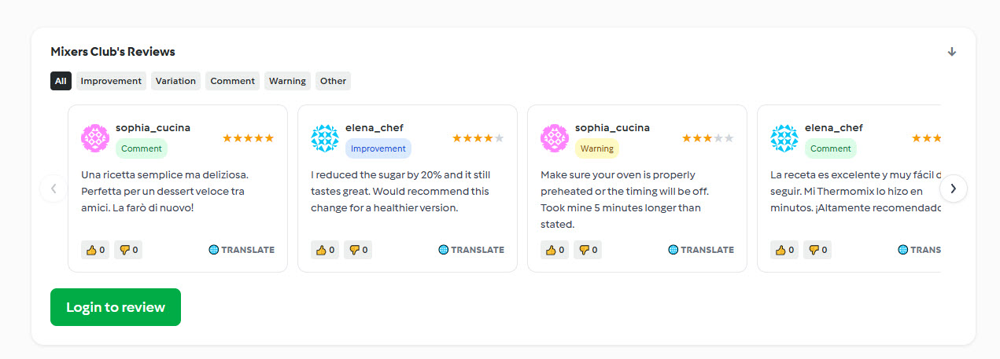

# Mixers Club

[](https://github.com/rodripf/mixers_club/actions/workflows/ci.yml)
[](https://github.com/rodripf/mixers_club/releases/latest)
[](https://github.com/rodripf/mixers_club/actions/workflows/ci.yml)

A browser extension (Chrome and Firefox) that adds a community layer to Cookidoo — the official Thermomix recipe platform. Browse community reviews on recipe pages, see trending recipes voted by fellow Thermomix users, and contribute your own tips and variations.

> **Disclaimer:** Mixers Club is an independent community project and is not affiliated with, endorsed by, or in any way related to Thermomix®, Vorwerk®, or Cookidoo®.

---

## Features

- **Community reviews** on every recipe page — star ratings, review types (improvement, variation, comment, warning), and threaded voting
- **Trending recipes** section on the Cookidoo home page — top-rated recipes of the month surfaced by the community
- **Like / dislike voting** on reviews with auto-hiding of low-quality content
- **Review types** — tag your review as an improvement, variation, comment, warning, or other
- **Translate** — one-click translation of reviews in other languages via Google Translate
- **Multi-locale** — works across all Cookidoo domains (ES, DE, FR, IT, UK, AU, NZ, JP, BR, BE, NL, PT, CH, AT, MX, CA) and shows reviews from all locales regardless of which domain you're on
- **Passwordless auth** — sign in with a magic link, no password required
- **Privacy-first** — your email is used only for authentication; a one-way SHA-256 hash is stored for avatar display

---

## Supported Languages

The extension UI is available in English, Spanish, Portuguese, Italian, German, French, Dutch, and Japanese. It auto-detects the language from your Cookidoo locale.

---

## Screenshots



See more: [Login](public/screenshots/login.jpg) · [Username setup](public/screenshots/username.jpg) · [Recipe page](public/screenshots/recipe-page.jpg) · [Trending recipes](public/screenshots/trending.jpg)

---

## Installation

### Chrome Web Store

[Install Mixers Club on the Chrome Web Store](https://chromewebstore.google.com/detail/mixers-club/khclelnkphbolaegfnfehihlnempngik)

### Firefox Add-ons

[Install Mixers Club on Firefox Add-ons (AMO)](https://addons.mozilla.org/en-US/firefox/addon/mixers-club/)

### Load unpacked (development)

1. Clone this repository
2. Copy `.env.example` to `.env` and fill in your Supabase credentials
3. Install dependencies and build:
   ```bash
   pnpm install
   pnpm run build
   ```
4. Open Chrome and go to `chrome://extensions`
5. Enable **Developer mode** (top right)
6. Click **Load unpacked** and select the `dist/` folder

---

## Development

### Prerequisites

- Node.js 18+
- pnpm

### Setup

```bash
pnpm install
```

### Environment variables

Create a `.env` file at the project root:

```env
VITE_SUPABASE_URL=https://your-project.supabase.co
VITE_SUPABASE_ANON_KEY=your-anon-key
```

### Commands

```bash
pnpm run build                                          # Chrome production build → dist/
pnpm run build:firefox                                  # Firefox production build → dist-firefox/
pnpm run test                                           # Run test suite (Vitest)
pnpm run typecheck                                      # TypeScript type checking
pnpm run publish -- <version>                           # Bump version, build, and package .zip for Chrome Web Store
pnpm run publish -- <version> --platform firefox        # Bump version, build, and package .zip for Firefox AMO
```

### How this was built

This project was created using **Claude Code** with the **[obra/superpowers](https://github.com/obra/superpowers)** plugin. Design specs, implementation plans, and architectural decisions can be found in the `docs/` directory:

- `docs/superpowers/specs/` — detailed design specifications
- `docs/superpowers/plans/` — task-by-task implementation plans

These documents provide full context on the feature development process and technical decisions made throughout the project.

### Project structure

```
src/
├── content-script/
│   ├── home-page/          # Trending section injected on the Cookidoo home page
│   ├── recipe-page/        # Reviews section, review form, vote handling
│   ├── auth-modal.ts       # Magic link sign-in modal
│   ├── dom-helpers.ts      # Shared DOM utilities (Gravatar, translate)
│   ├── error-map.ts        # Friendly Supabase error messages
│   ├── i18n.ts             # UI translations (EN/ES/PT/IT/DE/FR/NL/JA)
│   └── index.ts            # Entry point — page detection and auth callback handling
├── service-worker/
│   ├── api.ts              # Review, vote, and trending handlers
│   ├── auth.ts             # Auth handlers (magic link, session, username)
│   ├── index.ts            # Message router
│   └── supabase.ts         # Supabase client (storage wired to chrome.storage.local)
└── types.ts                # Shared TypeScript types
```

---

## Tech Stack

| Layer | Technology |
|---|---|
| Extension | Chrome MV3, TypeScript |
| Build | Vite |
| Backend | Supabase (PostgreSQL + Auth) |
| Tests | Vitest |
| Package manager | pnpm |

---

## Community Guidelines

Reviews are the responsibility of their authors. The community self-moderates through likes and dislikes — reviews with a high dislike ratio are automatically hidden.

The following is strictly prohibited: hate speech, discrimination, harassment, content promoting illegal activity, spam, and health-endangering misinformation. See [PRIVACY.md](PRIVACY.md) for full community rules.

**Use recipe modifications at your own risk.** Always apply your own judgment for food safety and allergen concerns.

---

## Privacy

We do not collect telemetry, analytics, or browsing data. Your email is used for authentication via Supabase. See [PRIVACY.md](PRIVACY.md) for the full privacy policy.

---

## License

[GNU GPLv3](LICENSE)
